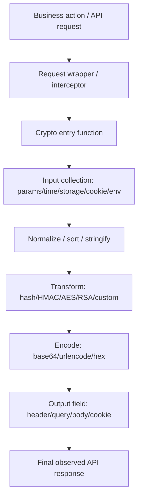

# Encryption Algorithm Graph

Domain:
Graph version:
Source run_id:
Last updated:

## Summary

| item | value |
|---|---|
| target endpoint |  |
| protected fields |  |
| script url/hash |  |
| auth_state/session scope |  |
| replay status |  |

## Mermaid Graph

## Field Mapping

| output field | location | generator | inputs | format | ttl/binding | evidence |
|---|---|---|---|---|---|---|
|  | header/query/body/cookie | script:function/offset |  |  |  |  |

## Call Chain

| order | script/hash | function/module/offset | role | evidence |
|---:|---|---|---|---|
| 1 |  |  |  |  |

## Algorithm Steps

1. 
2. 
3. 

## Inputs And Binding

| input | source | freshness | binding | notes |
|---|---|---|---|---|
| timestamp |  | fresh/stale/unknown | request/session/global |  |
| nonce/random |  | fresh/stale/unknown | request/session/global |  |
| cookie/storage |  | fresh/stale/unknown | session/profile |  |
| env/fingerprint |  | fresh/stale/unknown | profile/session |  |

## Validation Samples

| sample | browser output | reproduced output | match | artifact |
|---|---|---|---|---|
|  |  |  | yes/no/partial |  |

## Drift And Regression

| changed item | old | new | impact | required regression |
|---|---|---|---|---|
|  |  |  |  |  |

## Open Questions

- 
